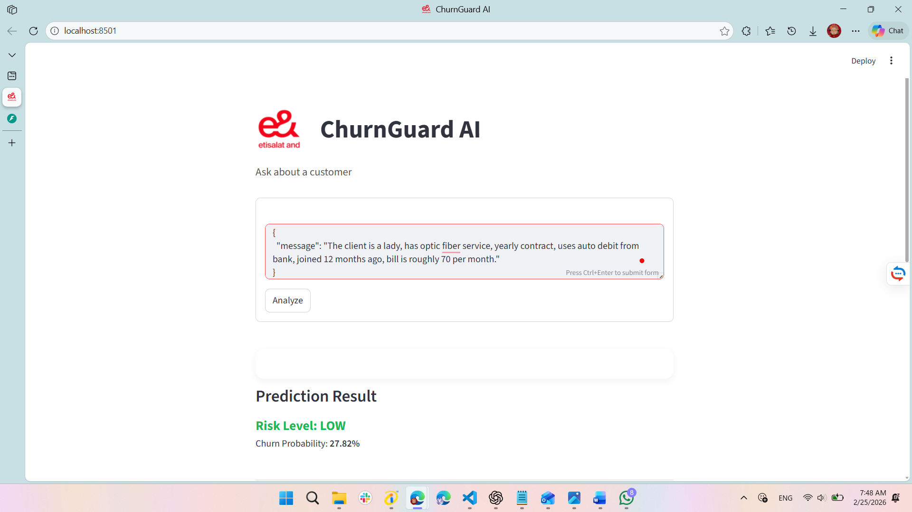

<div align="center">

# 🚀 Etisalat Customer Churn AI System  
### End-to-End AI-Powered Telecom Churn Prediction Platform


</div>

---

# 📌 Executive Summary

This project is a complete end-to-end AI system developed for a Telecom AI Engineer technical challenge.

The system predicts whether a telecom customer is likely to churn and provides an AI-generated explanation to support business decision-making.

It combines:

- 📊 Machine Learning model (Scikit-Learn)
- ⚡ FastAPI backend
- 💻 Streamlit interactive web interface
- 🤖 LLM-powered explanation engine
- 🧠 Modular architecture

---

# 🏗️ System Architecture

```
Customer Input
      ↓
Machine Learning Model (churn_model.pkl)
      ↓
FastAPI Backend (app.py)
      ↓
Streamlit Interface (streamlit_app.py)
      ↓
LLM Explanation Module (llm_model.py)
```

---

# 📸 Application Preview

## 🖥️ Streamlit User Interface



# 🎥 Demo Video

You can watch the full project demonstration here:

👉 **[Watch Demo Video](https://youtu.be/f9aYPzvubKM)**

The demo shows:
- Running the FastAPI backend
- Sending JSON request
- Receiving prediction and probability
- Generating AI explanation
- Using Streamlit interface

---

# 🧠 Machine Learning Model

### 📂 Dataset
Telco Customer Churn Dataset

### ⚙️ Preprocessing
- Feature encoding
- Data cleaning
- Numerical transformation

### 🤖 Algorithm
- Random Forest Classifier (replace if different)

### 📈 Output
- Churn Prediction (Yes / No)
- Probability Score
- AI-Generated Explanation

Saved model file:

```
churn_model.pkl
```

---

# ⚡ Backend – FastAPI

The backend exposes a REST API endpoint for churn prediction.

## Run Backend

```bash
pip install -r requirements.txt
uvicorn app:app --reload
```

API will run at:

```
http://127.0.0.1:8000
```

Swagger documentation:

```
http://127.0.0.1:8000/docs
```

---

# 💻 Frontend – Streamlit

Interactive web interface for entering customer data and viewing predictions.

## Run Streamlit App

```bash
streamlit run streamlit_app.py
```

---

# 📡 API Endpoint

## POST `/predict`

### Example Request

```json
{
  "tenure": 5,
  "MonthlyCharges": 95.5,
  "Contract": "Month-to-month"
}
```

### Example Response

```json
{
  "prediction": "Yes",
  "probability": 0.89,
  "explanation": "The customer is highly likely to churn due to short tenure and high monthly charges under a month-to-month contract."
}
```

---

# 📂 Repository Structure (GitHub Version)

```
.
├── app/
│   ├── app.py
│   ├── llm_model.py
│   └── inspect_model.py
│
├── model/
│   └── churn_model.pkl
│
├── ui/
│   └── streamlit_app.py
│
├── notebooks/
│   └── AI.ipynb
│
├── assets/
│   ├── logo.png
│   ├── streamlit_ui.png
│   ├── prediction_result.png
│   └── api_swagger.png
│
├── requirements.txt
└── README.md
```

---

# ⚠️ Important Note (Very Important)

Although the repository is organized into multiple folders for better structure and readability on GitHub:

> ✅ To run the project locally, place all Python files and the model file in the SAME folder before execution.

This ensures that import paths and file loading work correctly without modification.

---

# 🛠️ Technologies Used

| Technology | Role |
|------------|------|
| Python | Core language |
| Scikit-Learn | Machine learning |
| FastAPI | Backend API |
| Uvicorn | Server |
| Streamlit | Frontend |
| OpenAI API | LLM Explanation |
| Pandas | Data processing |
| NumPy | Numerical operations |
| python-dotenv | Environment variables |

---

# 🔐 Environment Variables

Create a `.env` file locally (do NOT upload to GitHub):

```
OPENAI_API_KEY=your_api_key_here
```

---

# 🎯 Key Features

✅ End-to-end ML pipeline  
✅ REST API design  
✅ Interactive UI  
✅ AI-powered business explanations  
✅ Clean modular architecture  
✅ Production-ready structure  

---

# 🚀 Future Improvements

- Model comparison (XGBoost, SVM)
- Docker containerization
- Cloud deployment
- Logging & monitoring
- CI/CD integration

---

# 👩‍💻 Author

**Rana Elbadry**  
AI Engineer | Machine Learning Enthusiast  
Alexandria, Egypt  

---

<div align="center">

⭐ If you find this project interesting, feel free to star the repository.

</div>
